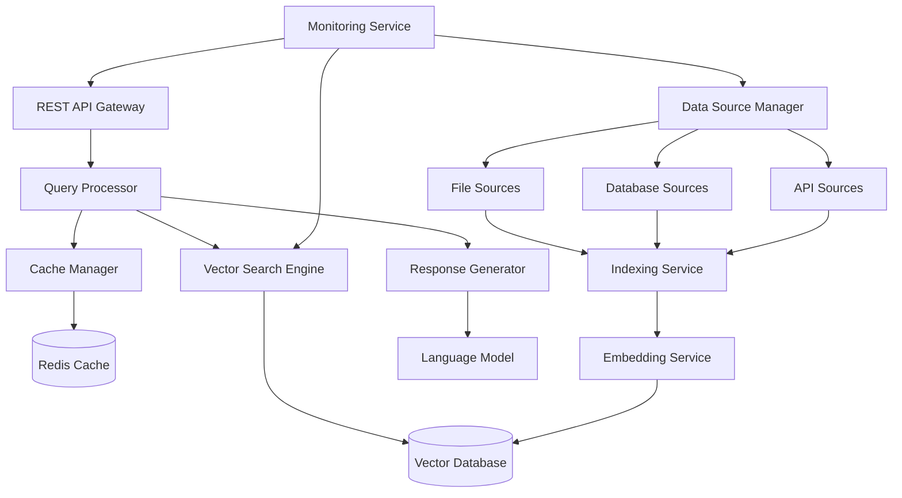

# Design Document

## Overview

The Fast RAG System is designed as a high-performance, modular architecture that prioritizes speed and efficiency while maintaining accuracy. The system uses a microservices approach with async processing, intelligent caching, and parallel data source querying to achieve sub-2 second response times.

## Architecture



The architecture consists of several key layers:

1. **API Layer**: REST API gateway handling requests and responses
2. **Processing Layer**: Query processing, caching, and response generation
3. **Search Layer**: Vector search engine with semantic capabilities
4. **Data Layer**: Multiple data source connectors and indexing
5. **Storage Layer**: Vector database and caching systems
6. **Monitoring Layer**: Performance tracking and health monitoring

## Components and Interfaces

### API Gateway
- **Purpose**: Handle HTTP requests, authentication, rate limiting
- **Technology**: FastAPI or Express.js for high performance
- **Interfaces**:
  - `POST /query` - Submit search queries
  - `GET /health` - System health check
  - `GET /sources` - List configured data sources
  - `POST /sources` - Add new data source
  - `GET /metrics` - Performance metrics

### Query Processor
- **Purpose**: Parse queries, orchestrate search across sources, manage caching
- **Key Methods**:
  - `processQuery(query: string, context?: object): Promise<QueryResult>`
  - `parseQuery(query: string): ParsedQuery`
  - `orchestrateSearch(parsedQuery: ParsedQuery): Promise<SearchResults>`

### Vector Search Engine
- **Purpose**: Perform semantic search using embeddings
- **Technology**: FAISS, Pinecone, or Weaviate for vector operations
- **Key Methods**:
  - `semanticSearch(embedding: number[], topK: number): Promise<SearchResult[]>`
  - `hybridSearch(query: string, filters: object): Promise<SearchResult[]>`

### Data Source Manager
- **Purpose**: Handle connections to various data sources
- **Supported Sources**:
  - File sources: PDF, TXT, MD, DOCX parsers
  - Database sources: PostgreSQL, MongoDB, Elasticsearch connectors
  - API sources: REST API clients with configurable endpoints
- **Key Methods**:
  - `addSource(config: DataSourceConfig): Promise<void>`
  - `validateSource(config: DataSourceConfig): Promise<boolean>`
  - `syncSource(sourceId: string): Promise<void>`

### Indexing Service
- **Purpose**: Process and index content from data sources
- **Features**:
  - Incremental indexing for efficiency
  - Content chunking and preprocessing
  - Metadata extraction and tagging
- **Key Methods**:
  - `indexContent(content: Content, sourceId: string): Promise<void>`
  - `updateIndex(sourceId: string, changes: ContentChange[]): Promise<void>`

### Embedding Service
- **Purpose**: Generate vector embeddings for content and queries
- **Technology**: Sentence Transformers, OpenAI embeddings, or local models
- **Key Methods**:
  - `generateEmbedding(text: string): Promise<number[]>`
  - `batchEmbeddings(texts: string[]): Promise<number[][]>`

### Cache Manager
- **Purpose**: Implement intelligent caching for frequent queries
- **Technology**: Redis with TTL and LRU eviction
- **Strategies**:
  - Query result caching
  - Embedding caching
  - Hot data preloading
- **Key Methods**:
  - `getCachedResult(queryHash: string): Promise<QueryResult | null>`
  - `setCachedResult(queryHash: string, result: QueryResult, ttl: number): Promise<void>`

### Response Generator
- **Purpose**: Synthesize search results into coherent responses
- **Features**:
  - Multi-source information synthesis
  - Source citation and attribution
  - Context-aware response formatting
- **Key Methods**:
  - `generateResponse(searchResults: SearchResult[], query: string): Promise<Response>`
  - `synthesizeInformation(results: SearchResult[]): Promise<string>`

## Data Models

### Query Model
```typescript
interface Query {
  id: string;
  text: string;
  context?: object;
  filters?: QueryFilter[];
  timestamp: Date;
  userId?: string;
}

interface QueryResult {
  id: string;
  response: string;
  sources: SourceReference[];
  confidence: number;
  processingTime: number;
  cached: boolean;
}
```

### Data Source Model
```typescript
interface DataSource {
  id: string;
  name: string;
  type: 'file' | 'database' | 'api';
  config: DataSourceConfig;
  status: 'active' | 'inactive' | 'error';
  lastSync: Date;
  documentCount: number;
}

interface DataSourceConfig {
  connectionString?: string;
  apiEndpoint?: string;
  filePath?: string;
  credentials?: object;
  syncInterval?: number;
}
```

### Content Model
```typescript
interface Content {
  id: string;
  sourceId: string;
  title: string;
  text: string;
  metadata: object;
  embedding: number[];
  chunks: ContentChunk[];
  lastUpdated: Date;
}

interface ContentChunk {
  id: string;
  text: string;
  embedding: number[];
  position: number;
  metadata: object;
}
```

## Error Handling

### Error Categories
1. **Data Source Errors**: Connection failures, authentication issues
2. **Processing Errors**: Embedding generation failures, parsing errors
3. **Search Errors**: Vector database timeouts, index corruption
4. **API Errors**: Rate limiting, invalid requests

### Error Handling Strategy
- **Graceful Degradation**: Continue with available sources when some fail
- **Retry Logic**: Exponential backoff for transient failures
- **Circuit Breaker**: Prevent cascade failures from problematic sources
- **Error Logging**: Structured logging with correlation IDs

### Error Response Format
```typescript
interface ErrorResponse {
  error: {
    code: string;
    message: string;
    details?: object;
    timestamp: Date;
    correlationId: string;
  };
}
```

## Testing Strategy

### Unit Testing
- Component isolation testing
- Mock external dependencies
- Test coverage target: 90%
- Focus on core logic: query processing, embedding generation, caching

### Integration Testing
- End-to-end query processing
- Data source connectivity
- Vector search accuracy
- Cache behavior validation

### Performance Testing
- Load testing with concurrent queries
- Response time benchmarking
- Memory usage profiling
- Database performance under load

### Test Data Strategy
- Synthetic test datasets for consistent benchmarking
- Real-world data samples for accuracy validation
- Edge case scenarios (empty results, large documents)

### Monitoring and Metrics
- Query response time percentiles (p50, p95, p99)
- Cache hit rates and effectiveness
- Data source health and sync status
- Error rates and types
- Resource utilization (CPU, memory, storage)

## Performance Optimizations

### Caching Strategy
- Multi-level caching (query results, embeddings, processed content)
- Intelligent cache warming for popular queries
- Cache invalidation on data source updates

### Parallel Processing
- Concurrent data source querying
- Batch embedding generation
- Async indexing operations

### Resource Management
- Connection pooling for databases
- Embedding model optimization
- Memory-efficient vector operations